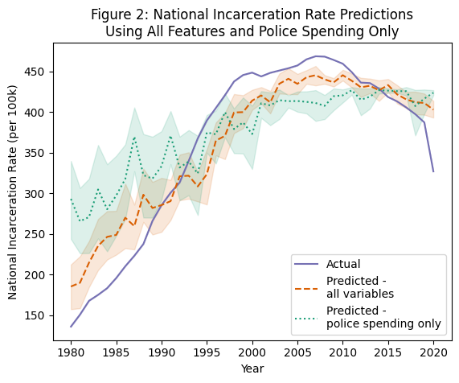
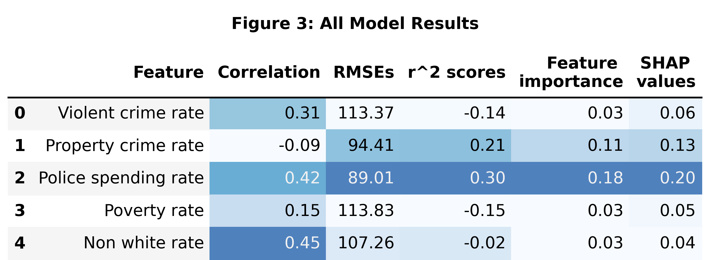

# Title, Team, and Affiliations

**Project title:** *Crime and What Else? Investigating the Predictive Power of Social Factors on Incarceration Rates*

| Name | Role | Willamette email |
|------|------|------------------|
| Emery Kerani | Owner Product Lead | eskerani@willamette.edu |

**Peer Stakeholder POs:** Mary Rose Krouse, Shanti Brodnick, Rohan Srinivas Babu

**Repository:** `https://github.com/eskerani/prison-predictor-capstone/tree/main`

# Abstract

Crime is often taken for granted as the primary driver of incarceration in the United States, without accounting for underlying factors (e.g. poverty) or large-scale policies that have expanded the prison-industrial complex to an unprecedented level. This project aims to evaluate the truth of this dominant narrative by utilizing machine learning to assess how well a variety of factors are able to predict incarceration rates. Among both single-feature models and a model using all features to generate predictions, police spending had the lowest error rate and highest feature importance, indicating that government spending on police is more closely associated with incarceration rates than crime.

# Introduction: Problem and Research Questions

**Problem statement:** The United States prison system currently holds nearly 2 million people, and for decades has imprisoned its inhabitants at one of the highest rates in the world (Lurigio, 2024). A variety of legal factors, including mandatory minimum sentences and “three strikes” laws, have contributed to the unprecedented rise in incarceration in the US since the 1970s and 80s (DeFina and Hannon, 2013; Lurigio, 2024). The US incarceration rate has since levelled off, remaining relatively steady since the 2010s; however, this does not reflect the nation’s crime rate, which has fallen since peaking in in the 1990s (Pettit and Gutierrez, 2013). Given that the US’s criminal legal system wields tremendous power—power that is most often turned against already disadvantaged individuals and their communities—it is important that we recognize protective and risk factors for incarceration, many of which are social in nature (Lurigio, 2024; Henry, 2020; Pettit and Gutierrez, 2013). This project seeks to interrogate the dominant narrative that crime is the primary cause of incarceration by examining three other risk factors. 


**Primary research question:** How do the predictive power of social factors (such as poverty, race, or government spending on police) compare to that of violent and property crime rates when using support vector regression to model the national incarceration rate?

**Changes since M1 proposal:** Given findings that crime rates were *not* the best predictor of incarceration, the secondary research question in M1 has been dropped.

# Impact and Stakeholders

The key stakeholders in this work are those who are most often targeted by criminalization and incarceration, primarily poor and BIPOC folks (Pettit and Gutierrez, 2013). Additionally, communities across the country are continually harmed by increasing incarceration rates, as incarceration has been shown to negatively impact both community health (Wildeman and Wang, 2017) and poverty (DeFina and Hannon, 2013). By critically examining the circumstances that can contribute to incarceration, this project seeks to uplift the work of organizations such as Transformative Justice Community and the Oregon Justice Resource Center, which advocate for solutions to harm that shift our paradigm away from imprisonment.

My shared theme is social justice and identity-driven disparity analysis. As others who are interested in social justice but perhaps not as familiar with the prison-industrial complex as I am, I hope that they’ll point out anywhere I make assumptions/lack context and help ensure that my project doesn’t steer anyone toward misinformed conclusions. 

# Related Work and Background

For decades, data science and statistics have played a massively important role in prison reform and abolition causes; as just one example, we have known for well over three decades that the population of Black prisoners is disproportionate to the Black population in the US [1]. Data concerning overall prison populations have also been key in tracking the effects of legislation concerning crime and sentencing, many of which contributed to astronomical growth of the US prison population [2]. Police spending is another facet of prior research, particularly when it comes to questions of how to effectively and durably address crime—while increased policing may reduce crime in the short term, studies suggest that diverting money from policing into social services more reliably reduces crime in the long term [3].

To this point, most of the work applying machine learning algorithms to data concerning the prison system has focused on predicting or classifying individual behaviors or risk factors. This project takes a more abstracted view of the legal system and its contributing factors as a whole.

# Data and Data Engineering

This project combines data from five sources, all of which are at the state level and contain information for the years 1980-2020. Data about the incarcerated population of each state (excluding federal prisoners) was obtained from the Bureau of Justice Statistics' Corrections Statistical Analysis Tool; crime data was downloaded from the FBI's Summary Reporting System (SRS); data on police spending was collected by the Census Bureau and made available for download by the Urban Institute's State and Local Finance Data tool; poverty data was collected by the Census Bureau and included the population of each state; and race data was estimated based on demographic information included in the IPUMS Current Population Survey (CPS). Given the historical nature of this project, all data sets were ingested as one-time .csv or .xlsx downloads. 

Once downloaded, the datasets were individually cleaned and wrangled into a standardized format. The IPUMS data was aggregated up to the state and year level, at which point the datasets could be joined together using state and year as the key. Using these combined data, all features were standardized by population (per 100k) based on the population estimates originally included in the poverty dataset. The resulting combined dataset contained 2,050 rows and 10 columns: state, year, total population, incarceration rate, total crime rate, violent crime rate, property crime rate, poverty rate, the rate of non-white residents, and police spending rate.

**Sources:**

| Source | Role | Access |
|--------|------|--------|
| Corrections Statistical Analysis Tool | Incarceration counts | One-time download |
| FBI Summary Reporting System | Crime counts | One-time download |
| Census Bureau via Urban Institute | Police spending data | One-time download |
| Census Bureau | Historical poverty data | One-time download | 
| IPUMS CPS | Race survey data | One-time download |

**Engineering summary:** Raw data in `data/raw/`; processed panel in `data/processed/`; cleaning script in `data/processed/data_cleaning.qmd`.

```{}
#| label: tbl-data-qc
#| tbl-cap: "Example QC summary (replace with your panel)"
#| echo: true

# Replace with your project data when ready:
# panel <- readRDS(here::here("data/processed/analysis_panel.rds"))
# nrow(panel)
knitr::kable(data.frame(
  check = c("Rows", "Counties", "Date range"),
  status = c("stub", "stub", "stub")
))
```

# Ethics and Responsible Use

- **Privacy:** Four out of the five datasets incorporated in this project were already highly aggregated to the state and year level. Data from the IPUMS CPS was downloaded at the original survey granularity (from which identifying household characteristics had been removed) and aggregated up to the state/year level. Thus, because these data represent a high-level overview, they pose very little risk to individuals. 

- **Fairness / equity:** Where associations are found between social factors such as race or poverty and incarceration, the data must not be interpreted as these factors being indicators of criminality. For example, though it has been demonstrated that Black people are disproportionately imprisoned in the US, this is due to overpolicing and systemic oppression and *not* because of any inherent association between Blackness and criminality. Under no circumstances should this project be used to justify further policing or incarceration of marginalized communities.

- **Limitations of setting:** The data used in this project come with several specific caveats attached. Police spending data was missing for all states in 2001 and 2003 through the Urban Institute; since the rise in police spending over the years is generally fairly steady, these values were imputed by averaging the spending in the years directly before and after years with missing data (which allowed the preservation of trends by state). For two years (2013 and 2017) of poverty data, there were two estimated counts published for both population and poverty levels due to new measures being introduced in the survey. The new measures were given to only a proportion of the population, but because in theory both versions were estimating the same thing the values were combined by averaging. Regarding the Summary Reporting System's crime data, a number of states were unable to provide complete data for various years. Where this happened, the FBI generated estimates by either extrapolating using a portion of the year's data, or applying regional trends to a state's most recent year of complete data. Additionally, several states have changed their reporting practices over time, which means that newer numbers may not be directly comparable to those collected previously. Finally, the SRS only collected information about the most serious offense that occurred in a given incident (e.g. if a homicide occurred in the course of a motor vehicle theft, only the homicide would be recorded), meaning that these data give us a clearer picture of the number of incidents that occurred rather than the actual total number of crimes. 

- **Non-causal framing:** This project only examines the associations between variables and thus no conclusions should be made about whether or not any of the predictive factors used *cause* incarceration. Further, these data and the features used are by nature interconnected; some of the features used to generate predictions may have impacted others (such as police spending and crime rates). Single-variable models in particular should thus be taken with a grain of salt as it is impossible to truly isolate any variable.

# Methods and Evaluation

**Design:** This project uses support vector regression (SVR), chosen because of its ability to deal with complex, non-linear data while remaining more straightforward than methods such as XGBoost. Default parameters were used for all models to ensure that each variable was treated the same way. Five single-variable models were trained, each using data from only one predictive factor to ensure that no other data affected predictions; in addition, one model was trained using all predictive factors as inputs in order to evaluate the importance of each factor when combined.

**Primary analysis:** 

**Evaluation metrics:** Three main evaluation metrics are used: correlation coefficient, r2 score, and root mean squared error (RMSE). The correlation coefficient is used as a preliminary evaluation of the linearity of relationships between variables, with the expectation that none will be particularly linear. r2 score is used to evaluate how much of the variance in incarceration rate can be explained by each model, while the RMSE measures the average error across predictions. Additionally, permutation importance and SHAP values are used to determine the most influential feature of the final multi-variate model. 

**Train / validation / holdout:** An 80-20 split was used to create training and testing datasets for use with models. This split was stratified by year to ensure that models were trained on a portion of the data from each year; the result was that a randomly selected 40 states in each year were used to train models (a total of 1,640 rows), while the remaining 10 states were used to generate predictions for a given year (totalling 410 rows). *Only* the relevant data (e.g. the feature and national incarceration rate in a single-variable model) were included in the training and testing data, so that models did not learn associations between year or state and incarceration rates. Additionally, all features were scaled using a robust scaler before training and testing, to eliminate any bias that could by caused by size differences in the variables. The models' predictions were also scaled accordingly, but were unscaled before calculating evaluation metrics to aid interpretibility. 

```{}
#| label: fig-methods-placeholder
#| fig-cap: "Replace with a methods diagram or exploratory plot"
#| echo: false
#| fig-width: 5
#| fig-height: 3

plot(1, 1, type = "n", xlab = "", ylab = "", main = "Methods figure placeholder")
text(1, 1, "Replace after M2/M3")
```

# Results and Visualizations

As expected, none of the features were linearly correlated with state incarceration rates; all had a “weak” correlation coefficient of less than 0.5. When using single features (i.e. only police spending) as predictors of the national incarceration rate, the models generated performed poorly: only two features (police spending at 89.01 and property crime rate at 94.41) had RMSEs of less than 100 people per 100k; additionally, the r2 scores (none above 0.3) indicate that no individual feature was able to explain the variance in the national incarceration rate particularly well. However, out of these poor models, the one trained on police spending rates had the best RMSE and r2 scores. 

[](./writeup_files/figure-html/all_graph.png)

A model trained on all features performed markedly better, with an RMSE of 53.65 and an r2 score of 0.74. Relative to all other features, police spending rate was the most important in generating this model’s predictions with a permutation importance of 0.16, which shows that the model’s performance suffered the most when police spending data was shuffled. Similarly, police spending had the highest SHAP value, which tells us that this was the most influential variable on the model's performance.

[](./writeup_files/figure-html/poster_table.png)


# Discussion, Limitations, and Future Work

**Interpretation:** The results above indicate that across the board, police spending rate serves as the best (or most important) predictor for national incarceration rate using SVR models. In all evaluation metrics, property crime rates were a close second, meaning that where crime was associated with incarceration rates in this project it was primarily property crime and not violent crime. Additionally, the performance difference between single-feature and combined-feature models confirms that none of these variables truly exist in isolation, and all must be accounted for in order to build a fuller picture of what might influence incarceration in the United States.

**Limitations:** One of the chief limitations of this work lies in the fact that much of the data used were estimates. The data sources used to calculate race and poverty rates were both surveys, and while both aim to provide representative information about the US population, they should not be taken as the definitive truth. Similarly, the data on crime counts was based only on *reports or arrests made*, which very likely results in undercounting; out of all reports, only seven crimes are accounted for in the FBI's Summary Reporting System (homicide, rape, robbery, aggravated assault, burglary, larceny, and motor vehicle theft), narrowing the pool even further. Additionally, as noted previously, this study was purely observational; no causal claims can be made about the links between any of the variables explored and incarceration. Rather, the goal of this project is to note associations between variables. 

**Future work:** Future work could explore variations in the type of incarceration (e.g. jails vs. prisons, men vs. women) or concentrate on smaller geographical areas such as counties to incorporate more data. 

# Conclusions and Recommendations

Police spending served as the most influential predictor of national incarceration rates. Any efforts to reduce incarceration should keep police and legal system spending in mind as a factor when engineering reforms. 

# Reproducibility and References

**Reproduce main results:**

```bash
cd your-repo
quarto render deliverables/M4-writeup-draft/writeup.qmd
```

**Dependencies:** `requirements.txt` or `renv.lock` in repo root.

**Data:** URLs and approval status documented in `docs/data-dictionary.md`.

# References

::: {#refs}
:::

<!-- Create refs.bib alongside this file. Example entries: -->

<!--
@article{liu2016,
  title={Wildfire-specific fine particulate matter and risk of hospital admissions in urban and rural counties},
  author={Liu, J. C. and others},
  journal={Epidemiology},
  year={2016}
}

@article{reid2016,
  title={Critical review of health impacts of wildfire smoke exposure},
  author={Reid, C. E. and others},
  journal={Environmental Health Perspectives},
  year={2016}
}
-->
