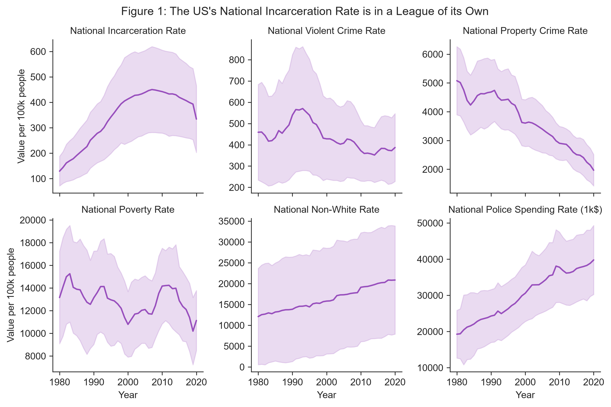
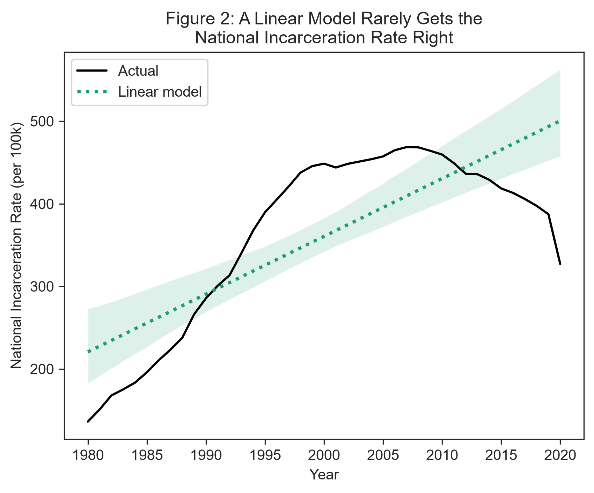
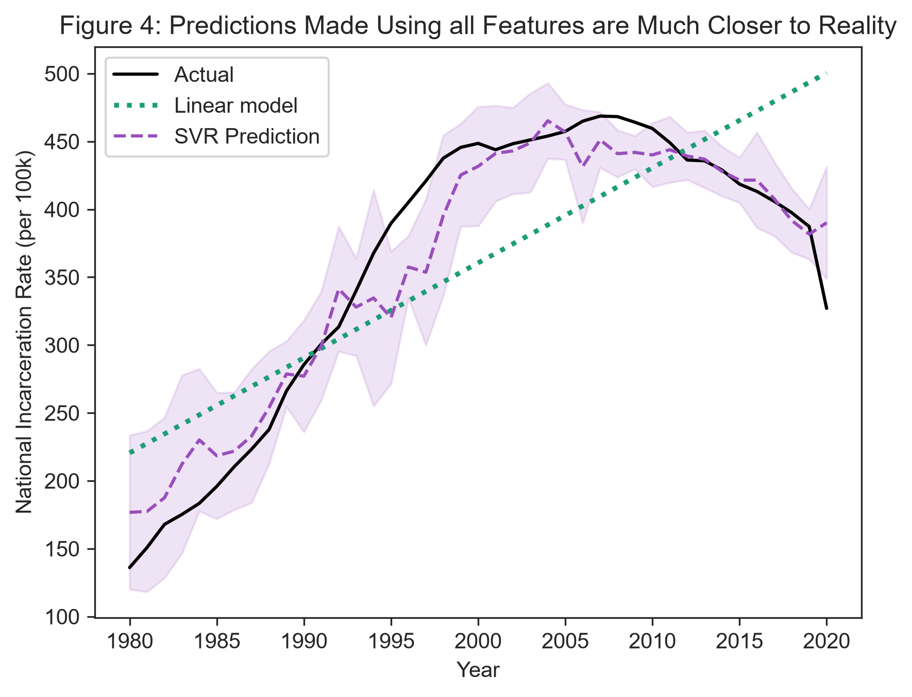
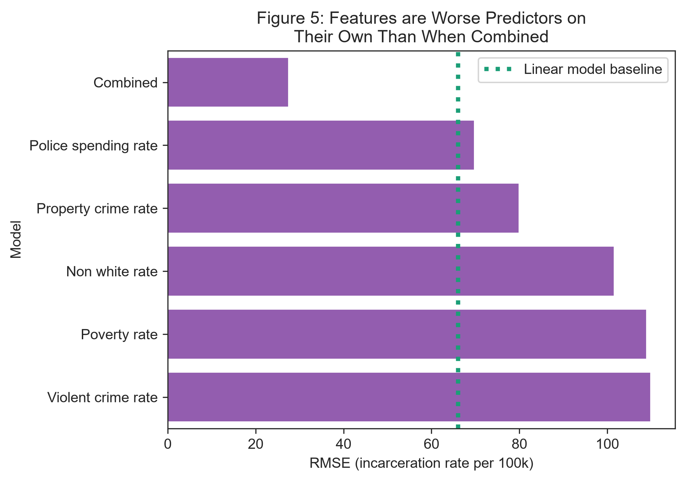
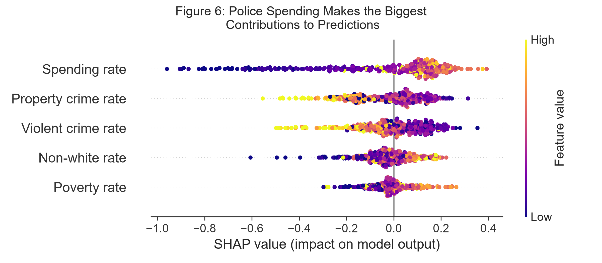

# Title, Team, and Affiliations

**Project title:** *Crime and What Else? Investigating the Predictive Power of Social Factors on Incarceration Rates*

| Name | Role | Willamette email |
|------|------|------------------|
| Emery Kerani | Owner Product Lead | eskerani@willamette.edu |

**Peer Stakeholder POs:** Mary Rose Krouse, Shanti Brodnick, Rohan Srinivas Babu

**Repository:** `https://github.com/eskerani/prison-predictor-capstone/tree/main`

# Abstract

Crime is often taken for granted as the primary driver of incarceration in the United States, without accounting for underlying factors (e.g. poverty) or large-scale policies that have expanded the prison-industrial complex to an unprecedented level. This project aims to evaluate the truth of this dominant narrative by utilizing machine learning to assess how well a variety of factors are able to predict incarceration rates. Among both single-feature models and a model using all features to generate predictions, police spending had the lowest error rate and highest feature importance, indicating that state and local government spending on police is a better predictor of the national incarceration rate than either violent or property crime. Additionally, though property crime served as a better predictor than violent crime, both types of crime had a negative association with the incarceration rate, meaning that higher crime rates drove down predictions. Though this is a purely correlational project, organizations and individuals working toward prison reform should consider measures that redirect funding away from police and towards social services. 

# Introduction: Problem and Research Questions

**Problem statement:** The United States prison system currently holds nearly 2 million people, and for decades has imprisoned its inhabitants at one of the highest rates in the world [@lurigio2024]. A variety of legal factors, including mandatory minimum sentences and “three strikes” laws, have contributed to the unprecedented rise in incarceration in the US since the 1970s and 80s [@defina2013; @lurigio2024]. The US incarceration rate has since levelled off, remaining relatively steady since the 2010s; however, this does not reflect the nation’s crime rate, which has fallen since peaking in in the 1990s [@pettit2018]. Given that the US’s criminal legal system wields tremendous power—power that is most often turned against already disadvantaged individuals and their communities—it is important that we recognize protective and risk factors for incarceration, many of which are social in nature [@lurigio2024; @henry2020; @pettit2018]. This project seeks to interrogate the dominant narrative that crime is the primary cause of incarceration by examining three other risk factors. 

**Primary research question:** How do the predictive power of social factors (such as poverty, race, or government spending on police) compare to that of violent and property crime rates when using support vector regression to model the national incarceration rate?

**Secondary research question:** How does the predictive power of crime vary across different types of crime (violent vs. property crimes)?

# Impact and Stakeholders

The key stakeholders in this work are those who are most often targeted by criminalization and incarceration, primarily poor and BIPOC folks [@pettit2018]. Additionally, communities across the country are continually harmed by increasing incarceration rates, as incarceration has been shown to negatively impact both community health and poverty [@defina2013; @wildeman2017]. By critically examining the circumstances that can contribute to incarceration, this project seeks to uplift the work of organizations such as Transformative Justice Community (TJC) and Safety and Justice Oregon (SJO). These organizations represent two aspects of the growing movements of transformative justice and restorative justice, which broadly seek to dismantle the United States' current system of retributive and biased mass incarceration in favor of community-focused and harm-repairing solutions [@kim2020]. TJC focuses on creating community support networks for formerly incarcerated folks re-entering broader society, while SJO advocates for legal reforms and access to resources like housing that can divert individuals away from the criminal legal system [@tjc; @sjo]. These are only two approaches in a broad and varied movement that searches for solutions to the structural violence perpetuated by mass incarceration [@pettit2018; @defina2013; @wildeman2017]. 

# Related Work and Background

For decades, data science and statistics have played a massively important role in prison reform and abolition causes; as just one example, we have known for well over three decades that the population of Black prisoners is disproportionate to the Black population in the US [@tonry1994]. Data concerning overall prison populations have also been key in tracking the effects of legislation concerning crime and sentencing, many of which contributed to astronomical growth of the US prison population [@mauer2001]. Police spending is another facet of prior research, particularly when it comes to questions of how to effectively and durably address crime—while increased policing may reduce crime in the short term, studies suggest that diverting money from policing into social services more reliably reduces crime in the long term [@beck2025].



The raw data themselves can also reveal disparities in trends across time. As mentioned previously, the national incarceration rate grew exponentially in the 1980s and 90s, before levelling off around 2010 and then starting to fall [@bjs]. Crime rates, however, have followed a very different pattern: the violent crime rate peaked in the mid-1990s and has been falling fairly steadily since, with only minor peaks; property crime rates have been falling consistently for virtually the entire window examined by this project [@fbi]. There is thus a clear disconnect between the national incarceration rate and both violent and non-violent crime rates. On first glance, both the rate of non-white residents and the rate of government spending on police mirror the incarceration rate much more clearly, with both growing somewhat linearly since the 1980s [@ipums; @spending]. The national poverty rate shows the most variability out of the factors examined, with various peaks and valleys over time [@pov].

To this point, most of the work applying machine learning algorithms to data concerning the prison system has focused on predicting or classifying individual behaviors or risk factors. This project takes a more abstracted view of the legal system and its contributing factors as a whole in order to investigate the associations between variables.

# Data and Data Engineering

This project combines data from five sources, all of which are at the state level and contain information for the years 1980-2020. Data about the incarcerated population of each state (excluding federal prisoners) was obtained from the Bureau of Justice Statistics' Corrections Statistical Analysis Tool; crime data was downloaded from the FBI's Summary Reporting System (SRS); data on police spending was collected by the Census Bureau and made available for download by the Urban Institute's State and Local Finance Data tool; poverty data was collected by the Census Bureau and included the population of each state; and race data was estimated based on demographic information included in the IPUMS Current Population Survey (CPS; see Table 1 for citations). Given the historical nature of this project, all data sets were ingested as one-time .csv or .xlsx downloads. 

*Table 1: Sources*

| Source | Role | Access | Citation |
|--------|------|--------|----------|
| Corrections Statistical Analysis Tool | Incarceration counts | One-time download | [@bjs] |
| FBI Summary Reporting System | Crime counts | One-time download | [@fbi] | 
| Census Bureau via Urban Institute | Police spending data | One-time download | [@spending] | 
| Census Bureau | Historical poverty data | One-time download | [@pov] |
| IPUMS CPS | Race survey data | One-time download | [@ipums] |

After being downloaded, the datasets were individually cleaned and wrangled into a standardized format. Incarceration data was pivoted from a wide to a long format, and national totals which included federal prisoners were excluded in favor of focusing on summed state values. Relevant columns were selected from the crime data and a new column was created to denote the total crime count by adding the violent crime and property crime columns. The District of Columbia was filtered out of the police spending data, and data types were made explicit; the Urban Institute provided all data in real 2022 dollars, meaning that spending was already adjusted for inflation. The format of the poverty dataset required a loop to extract the data, which were all stored in a single column that also included rows with years and state names. Finally, the CPS data  required several steps: first, a binary variable was created to denote whether a given survey respondent identified as white or not; then the data were aggregated up to the state and year level using the weights included in the data, at which point the percentage and count per 100,000 people of each race category could be calculated; the last step was converting the FIPS codes provided by IPUMS to standard state abbreviations to be used when joining the data.

Once all datasets had been cleaned and aggregated to the state and year level, they were joined together by state and year and filtered for the years 1980-2020. Using these combined data, all features were standardized by population (per 100k) based on the population estimates originally included in the poverty dataset. Additionally, yearly national totals were calculated for the population, poverty, and race columns. 

Though these data were generally fairly complete upon download, there were two notable quality issues encountered during the cleaning process. Police spending data was missing for all states in 2001 and 2003 through the Urban Institute; since the rise in police spending over the years is generally fairly steady, these values were imputed by averaging the spending in the years directly before and after years with missing data (which allowed the preservation of trends by state). Further, for two years (2013 and 2017) of poverty data, there were two estimated counts published for both population and poverty levels due to new measures being introduced in the survey. The new measures were given to only a proportion of the population, but because both versions aimed to estimate the same thing the values were combined by averaging.

The final combined dataset contained 2,050 rows and 10 columns: state, year, total population, incarceration rate, total crime rate, violent crime rate, property crime rate, poverty rate, the rate of non-white residents, and police spending rate.

**Engineering summary:** Raw data can be found in `data/raw/`. Cleaned individual datasets were deposited in `data/interim/`, which also contains a brief exploratory analysis. The processed and combined panel is in `data/processed/`, alongside the script used for cleaning at `data/processed/data_cleaning.qmd`.

# Ethics and Responsible Use

**Privacy:** Four out of the five datasets incorporated in this project were already highly aggregated to the state and year level. Data from the IPUMS CPS was downloaded at the original survey granularity (from which identifying household characteristics had already been removed) and aggregated up to the state/year level. Thus, because these data represent a high-level overview, they pose very little risk to individuals. 

**Fairness / equity:** Where associations are found between social factors such as race or poverty and incarceration, the data must not be interpreted as these factors being indicators of criminality. For example, though it has been demonstrated that Black people are disproportionately imprisoned in the US, this is due to overpolicing and systemic oppression, *not* because of any inherent association between Blackness and criminality [@brown2021]. Under no circumstances should this project be used to justify further policing or incarceration of marginalized communities.

**Limitations of setting:** The data used in this project come with several specific caveats attached. In particular, the accuracy of the Summary Reporting System's crime data is impacted by several factors. A number of states were unable to provide complete data for various years; where this happened, the FBI generated estimates by either extrapolating using a portion of the year's data, or applying regional trends to a state's most recent year of complete data. Additionally, several states have changed their reporting practices over time, which means that newer numbers may not be directly comparable to those collected previously. Finally, there are two collection quirks: the SRS only collected information about the most serious offense that occurred in a given incident (e.g. if a homicide occurred in the course of a motor vehicle theft, only the homicide would be recorded), meaning that these data give us a clearer picture of the number of incidents that occurred rather than the actual total number of crimes. Data were also only collected for certain crimes within each category: homicide, rape, robbery, and aggravated assault are the violent crimes included, while the property crimes are made up of burglary, larceny, and motor vehicle theft. These two factors, combined with the fact that the SRS's counts are based only on reports or arrests made and tendencies to misclassify crimes in reports, mean that the SRS represents only a portion of the actual number of crimes committed in the US in a given state and year [@nolan2011]. Further, it must be noted that all data used in this project are the product of surveys; though these surveys aim for representativeness, they can still only generate estimates, and thus these data should not be interpreted as the objective truth. 

**Non-causal framing:** This project only examines the associations between variables and thus no conclusions should be made about whether or not any of the predictive factors used *cause* incarceration. Moreover, these data and the features used are by nature interconnected; some of the features used to generate predictions may have impacted others (such as police spending and crime rates). Single-variable models in particular should thus be taken with a grain of salt as it is impossible to truly isolate any variable.

# Methods and Evaluation

**Design:** This project primarily uses support vector regression (SVR) as its prediction algorithm, chosen because of its ability to deal with complex, non-linear data while remaining more straightforward and interpretable than methods such as XGBoost. SVR is also optimized for smaller datasets, which makes it an ideal choice for this project. All SVR models are compared to a baseline linear regression model, which was fitted to predict the national incarceration rate for each year of data. This was used to assess whether the predictions generated by the non-linear SVR models fit the actual national incarceration trend better than a simple line. 

Five single-variable models were trained, each using data from only one predictive factor to ensure that no other data affected predictions. Default parameters were used for all of these models, both to ensure that each variable was treated the same way and because tuned models performed slightly worse than the default models for three out of five variables. In addition, one model was trained using all predictive factors as inputs in order to evaluate the importance of each factor when combined. This multi-variate model was tuned using a grid search, which evaluated the model's performance (based on the root mean squared error) on every combination of a given set of hyperparameters in order to select the best combination. The hyperparameters in question were *epsilon*, which dictates how tolerant of errors the model is before penalizing them (forming its margin); *C*, which influences how much the model penalizes points that fall outside of the predictive margin; and *gamma*, which dictates how much individual training data points impact predictions. All SVR models used a radial basis function (RBF) kernel, which allowed them to account for non-linear relationships.

All SVR models made predictions of the national incarceration rate using state-level variables, at which point the predictions were averaged by year to create a singular, aggregated prediction of the national incarceration rate for each year. This method turns SVR into a pseudo-voting regressor model and was chosen to mimic the way that state-level factors influence national outcomes (e.g. how the national incarceration rate for a given year in itself is roughly the average of all state incarceration rates in that year). These aggregated predictions were then used to calculate model evaluation metrics, using the real national incarceration rate as the true value. 

**Evaluation metrics:** Three main evaluation metrics are used: correlation coefficient, R<sup>2</sup> score, and root mean squared error (RMSE). The correlation coefficient is used as a preliminary evaluation of the linearity of relationships between variables, with the expectation that none will be particularly linear. The R<sup>2</sup> score is used to evaluate how much of the variance in incarceration rate can be explained by each model, while the RMSE measures the average error across predictions. Additionally, permutation importance and SHAP values are used to determine the most influential feature of the final multi-variate model. The permutation importance of each feature is generated by randomly shuffling all of that feature's data points in the test set and measuring how much the model's predictions suffer overall as a result. SHAP values function slightly differently, by calculating each feature's contribution to each prediction. The features that play the biggest role in driving predictions in either the positive or negative direction are said to be the most important. These two measures combine to provide a more robust understanding of how each feature factors into the model's predictions.

**Train / validation / holdout:** Before modelling was performed, multicollinearity between predictive variables was checked using the variance inflation factor (VIF), which evaluates the extent to which correlations between predictors influence the variation in a model's outcomes. An 80-20 split was then used to create training and testing datasets for use with models. This split was stratified by year to ensure that models were trained on a portion of the data from each year; the result was that a randomly selected 40 states in each year were used to train models (a total of 1,640 rows), while the remaining 10 states were used to generate predictions for a given year (totalling 410 rows). *Only* the relevant data (e.g. the feature and national incarceration rate in a single-variable model) were included in the training and testing data, so that models did not learn associations between year or state and incarceration rates. Additionally, all features were scaled using a robust scaler before training and testing, to eliminate any bias that could by caused by size differences in the variables. The models' predictions were also scaled accordingly, but were unscaled before calculating evaluation metrics to aid interpretibility. 

# Results and Visualizations

As expected, none of the features were linearly correlated with state incarceration rates; all had a “weak” correlation coefficient of less than 0.5, demonstrating that none of these variables have an immediately clear influence on incarceration rates. Of the variables investigated, the non-white rate was the most correlated with incarceration rates at 0.46 and police spending was similar at 0.42, while the violent crime rate, poverty rate, and property crime rate all scored lower at 0.31, 0.15, and -0.08, respectively. The VIF was also checked both before and after scaling to evaluate correlations between predictive variables. Prior to scaling, the police spending rate, poverty rate, and violent crime rate had VIFs of 5.94, 8.52, and 9.14, demonstrating high multicollinearity. The property crime rate had a VIF of 11.08, which indicates particularly high standard error inflation due to correlations between variables. The non-white rate was the only variable that showed moderate collinearity at 3.22. After scaling, these numbers were dramatically reduced: all variables had VIFs ranging from 1.24 at the lowest (non-white rate) to 2.19 at the highest (violent crime rate), signifying moderate amounts of correlation between variables but nothing that would seriously inflate a model's standard error. 



The first model, a linear model that was fitted to the national incarceration rate as a function of the year, was largely unable to account for the rate at which the national incarceration rate rose. It first overpredicted in the 1980s, underpredicted from the 1990s to the 2010s, and then overpredicted once more as the incarceration rate started to fall in the 2010s. The RMSE of this model was 66.03, meaning that on average its predictions were off by about 66 people incarcerated per 100,000. This is a fairly large margin of error given that at its peak the national incarceration rate was under 500 people incarcerated per 100,000. The model's R<sup>2</sup> score was middling at 0.611, leaving around 40% of the variance in the national incarceration rate unaccounted for. 


However, the linear baseline model still performed better than the first five SVR models. When using single features (i.e. only police spending) as predictors of the national incarceration rate, the models generated performed poorly. Only two features (police spending at 69.83 and property crime rate at 79.95) had RMSEs of less than 100 people per 100k, with the violent crime rate, poverty rate, and non-white rate coming in at 109.92, 108.95, and 101.65. With the exception of police spending, the RMSE of which was within 3 units of the linear model's, using single features as predictors generated models that were all much more prone to error than the linear model. 

For the most part, the R<sup>2</sup> scores were similarly low. Several negative R<sup>2</sup> scores, for the violent crime rate (-0.08) and poverty rate (-0.06) indicate outright that the linear model better explained the variance in the national incarceration rate; though positive, the poverty rate's R<sup>2</sup> score (0.08) indicates that only a very small fraction of the national incarceration rate is explainable by poverty. The property crime rate and police spending rate scored just under and over 0.5 at 0.43 and 0.57, respectively, indicating that these features are able to account for about 50% (+/- 7%) of the variance in the national incarceration rate. Similar to the RMSE, the police spending rate was the only variable that achieved an R<sup>2</sup> score anywhere near that of the linear model. Though all of the single-feature models were worse than a linear model, the one trained on police spending rates had the best RMSE and R<sup>2</sup> score, and was thus the closest to being on par with the linear model. 



A model trained on all features performed markedly better, with an RMSE of 39.6 and an R<sup>2</sup> score of 0.86 after averaging predictions across years. Tuning improved these values to 27.5 and 0.93, respectively. In either case, the model's RMSE was well below that of the linear baseline, distinguishing it as the only SVR model used in this project that achieved better performance than a linear model. The tuned model's predictions also had under half the average error of the best single-feature model, and nearly doubled its R<sup>2</sup> value.



Relative to all other features, police spending rate was the most important in generating the tuned model’s predictions with a permutation importance of 0.239, which shows that the model’s performance suffered the most when police spending data was shuffled. The violent crime rate had the second-largest permutation importance at 0.15, followed by the property crime rate, non-white rate, and poverty rate at 0.143, 0.109, and 0.068, respecitvely. Similarly, police spending had the highest average absolute SHAP value (0.21), which suggests that variable had the greatest influence on the model's performance. Spending was followed in SHAP values by the property crime rate (0.12), the violent crime rate (0.11), the non-white rate (0.08), and the poverty rate (0.06). 



The graph above displays the SHAP values for all variables on the x axis, using color to denote a given point's value relative to the other points of the variable. This can thus be used to better understand the directional associations between variables and predictions. Of particular note is the fact that lower values for police spending rate tend to drive the model's prediction for incarceration rate downwards, while higher values drive it upwards; the poverty rate and non-white rate mimic this association to a lesser magnitude. In the case of both the property and violent crime rate, however, this association is reversed: *higher* crime rates drive incarceration rate predictions downwards, while lower crime rates tend to drive it upwards.

*Table 2: All model results (ordered by RMSE)*

| Feature | Correlation | RMSEs | R2 scores | Feature importance | SHAP values |
|---------|-------------|-------|-----------|--------------------|-------------|
| Police spending rate | 0.42 | 69.83 | 0.57 | 0.24 | 0.21 |
| Property crime rate | -0.09 | 79.95 | 0.43 | 0.14 | 0.12 |
| Non-white rate | 0.45 | 101.65 | 0.08 | 0.11 | 0.08 |
| Poverty rate | 0.15 | 108.95 | -0.06 | 0.07 | 0.06 |
| Violent crime rate | 0.31 | 109.92 | -0.08 | 0.15 | 0.11 |

Of the decades included in analysis, the multi-variable model generated the best predictions for 2000 onward (with RMSEs of 17.91 and 20.41 for the 2000s and 2010s, respectively) and performed slightly worse on data from the 1980s (which had an RMSE of 24.21). The 1990s was the decade with the highest error by far, at an RMSE of 40.15. This suggests that the input features may have been less associated with the national incarceration rate in the 1990s in particular, and vice versa for the 2000s. With respect to geography, the model's accuracy varied widely: the model largely performed the best in the South, with the West and East South Central census regions (comprised of Arkansas, Louisiana, Oklahoma, Texas, Alabama, Kentucky, Mississippi, and Tennessee) both having RMSEs of less than 40. The West North Central, Pacific, New England, and East North Central regions all had RMSEs of 40-44, while the South Atlantic, Mountain, and Middle Atlantic regions performed the worst, all with with RMSEs of almost 50 or above. However, it must be noted that predictions were not generated based on even numbers of instances of states from each region in the testing data; due to stratification by year when creating the train-test split, the state distributions were shuffled and thus regional appearances in testing data vary widely from 23-79.

# Discussion, Limitations, and Future Work

**Interpretation:** The results above indicate that across the board, police spending rate serves as the best (or most influential) predictor for national incarceration rate using SVR models. Using SHAP values as an indicator of directionality, lower police spending resulted in lower predicted incarceration rates. In nearly all evaluation metrics, property crime rates were a close second, meaning that where crime was associated with incarceration rates in this project it was primarily property crime and not violent crime. Both types of crime were negatively associated with predictions--where crime rates were higher, incarceration rate predictions were pushed lower (and vice versa). This finding is supported by the fact that until the 2010s, the national incarceration rate was continuously rising despite both violent and property crimes falling in that same period [@bjs]. Additionally, the performance difference between single-feature and combined-feature models (and the difference between the single-feature SVR models and a linear baseline model) confirms that none of these variables truly exist in isolation, and all must be accounted for in order to build a fuller picture of what might influence incarceration in the United States. 

**Limitations:** One of the chief limitations of this work lies in the fact that much of the data used were estimates. All data sources were based on surveys and should not be taken as the definitive truth. Similarly, the data on crime counts was based only on *reports or arrests made*, which very likely results in undercounting, and only a small number of offenses were included in the SRS, narrowing the pool even further [@nolan2011]. Finally, this study was purely observational. No causal claims can be made about the links between any of the variables explored and incarceration. Rather, the goal of this project is to note associations between variables. 

**Future work:** Future work could include exploring how predictions function when examining variations in the type of incarceration (e.g. jails vs. prisons, men vs. women); concentrating on smaller geographical areas such as counties to incorporate more data and look at more granular associations; using more complex models such as XGBoost or neural networks; or examining variations on the data used here (e.g. looking at different types of police spending or incorporating a wider definition of each crime type). 

# Conclusions and Recommendations

Police spending largely served as the most influential predictor of national incarceration rates, and in particular lower police spending drove predictions up while higher spending drove them down. Low-performing single-feature models (which all had RMSEs of twice or more that of a multi-variate model) indicated that no single factor can fully account for the US's incarceration rate. Taken together these results suggest that diverting funding from police to social services or other government functions [as explored by @beck2025] may be associated with lowered incarceration rates. Thus, any efforts to reduce incarceration should take a wide variety of factors into account, but keep police and legal system spending in mind as a factor when engineering reforms.

# Reproducibility and References

**Reproduce main results:**

```bash
cd prison-predictor-capstone
quarto render data/processed/data_cleaning.qmd
quarto render deliverables/M5-final/analysis.qmd
```

**Dependencies:** `requirements.txt` in repo root.

